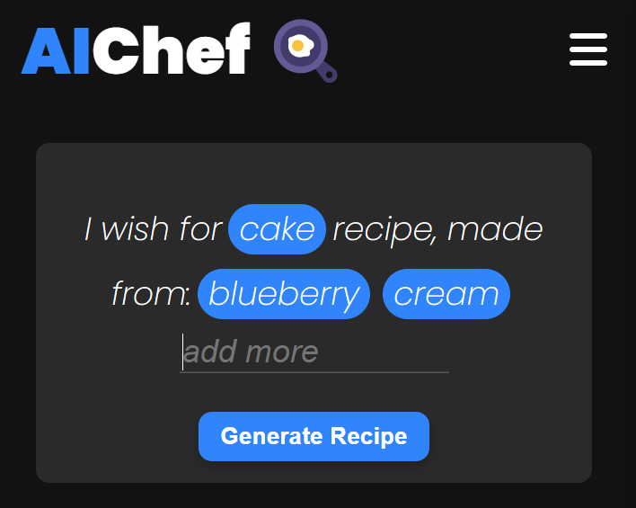

# AIChef - Generated Recipes
AIChef is a platform for discovering new and innovative recipes created using artificial intelligence. AIChef is perfect for professional chefs and home cooks alike to find unique dishes and explore endless culinary possibilities. Come and discover the exciting world of AI-generated recipes!

This mini project was developed by Omer Gatenio as part of a journey to become a full-stack developer.

I created this project using some of the knowledge I gained in:
- NextJS
- Typescript
- React
- OpenAI
- HTML, CSS ,JavaScript
- Graphic Design
- Git

.
.
.

I hope you enjoyed reading about this project, thank you for your time 😁

Live site: https://ai-chef.vercel.app/

Github repo: https://github.com/gateniomer/AIChef

